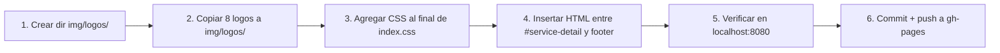

# Plan: Carrusel de Logos - "Colegios que Confían en Nosotros"

## Objetivo

Agregar una sección de carrusel de logos de colegios clientes debajo de las tarjetas de planes (`#service-detail`) en [`monti-escolares.html`](monti-escolares.html), que haga transición suave al footer actual.

---

## 1. Ubicación en la página

El carrusel debe insertarse **entre** [`#service-detail`](monti-escolares.html:112) (línea 234) y [`<footer>`](monti-escolares.html:239) (línea 239).

```
┌──────────────────────────────────┐
│   #service-detail (fondo blanco) │
│   ┌────── Planes Grid ────────┐  │
│   └───────────────────────────┘  │
├──────────────────────────────────┤ ← AQUÍ: NUEVA section
│   #logos-carousel (fondo offwhite)│
│   "Colegios que confían          │
│    en nosotros"                  │
│   [logo]→[logo]→[logo]→[logo]→  │  (carrusel animado infinito)
│   [logo]→[logo]→[logo]→[logo]→  │
├──────────────────────────────────┤
│   <footer> (fondo negro)          │
└──────────────────────────────────┘
```

---

## 2. Diseño visual

| Propiedad | Valor CSS | Razón |
|-----------|-----------|-------|
| **Fondo** | `--color-offwhite` (#fafafa) | Separa del blanco de planes y negro del footer |
| **Padding** | `5rem 0` → `3rem 0` en móvil | Aire vertical estándar |
| **Título h2** | `--font-heading`, `--fs-lg`, `--color-black` | Misma tipografía que resto de la página |
| **Subtítulo p** | `--font-body`, `--fs-sm`, `--color-gray-500` | Texto secundario sutil |
| **Altura logo** | `80px` → `60px` en móvil | Visible sin ocupar demasiado |
| **Gap entre logos** | `3rem` → `2rem` en móvil | Separación limpia |

### Efecto visual de logos

- **Reposo**: `filter: grayscale(100%) opacity(0.6)` — logos en gris suave
- **Hover**: `filter: grayscale(0%) opacity(1)` — logo a color completo

---

## 3. Comportamiento del carrusel (solo CSS)

```
┌─────────────────── track-wrapper (overflow: hidden) ───────────────────┐
│                                                                        │
│  ┌────────────── logos-track (animación translateX -50%) ────────────┐ │
│  │                                                                     │ │
│  │  [L1][L2][L3][L4][L5][L6][L7][L8]│[L1][L2][L3][L4][L5][L6][L7][L8] │ │
│  │         └─── 8 originales ──┘│└─── duplicados (scroll infinito) ─┘ │ │
│  └─────────────────────────────────────────────────────────────────────┘ │
└──────────────────────────────────────────────────────────────────────────┘
```

| Propiedad | Valor |
|-----------|-------|
| **Animación** | `@keyframes logosScroll` de 0% a -50% |
| **Duración** | `30s linear infinite` |
| **Hover** | `animation-play-state: paused` |
| **Ciclo completo** | Los 16 logos (8 original + 8 duplicados) pasan en 30s |

---

## 4. Archivos de logo

**Origen**: `/Users/ferminvicente/Downloads/Colegio/`  
**Destino**: `img/logos/` dentro del proyecto

| Archivo original | Copia en proyecto |
|---|---|
| `Claret.png` | `img/logos/claret.png` |
| `Logo_Primario-tagline@3x.png` | `img/logos/logo-primario.png` |
| `logo colegio.png` | `img/logos/logo-colegio.png` |
| `0000.png` | `img/logos/colegio-0000.png` |
| `images-2.png` | `img/logos/colegio-2.png` |
| `images-4.jpeg` | `img/logos/colegio-4.jpeg` |
| `aefd99_d15913f868f849ceaaf74805ba81351a~mv2.jpg` | `img/logos/colegio-aefd.jpg` |
| `ChatGPT Image 9 jul 2026, 06_54_51 p.m..png` | `img/logos/colegio-chatgpt.png` |

Los subdirectorios (`Mannatail del conocimiento/`, `PNG Logo Arboleda/`, `PRADITOS/`, `sadfb/`) están **vacíos**, no contienen archivos.

---

## 5. HTML de la nueva sección

```html
    <!-- ==========================================
       LOGOS CAROUSEL - Instituciones que confían
       ========================================== -->
    <section class="section section-logos" id="logos-carousel">
        <div class="container">
            <div class="section-header reveal">
                <h2>Colegios que confían en nosotros</h2>
                <p>Colegios que ya forman parte de nuestra comunidad educativa.</p>
            </div>

            <div class="logos-track-wrapper reveal">
                <div class="logos-track">
                    <!-- Primera copia -->
                    <div class="logo-item">
                        
                    </div>
                    <div class="logo-item">
                        
                    </div>
                    <div class="logo-item">
                        
                    </div>
                    <div class="logo-item">
                        
                    </div>
                    <div class="logo-item">
                        
                    </div>
                    <div class="logo-item">
                        
                    </div>
                    <div class="logo-item">
                        
                    </div>
                    <div class="logo-item">
                        
                    </div>
                    <!-- Segunda copia (duplicada para scroll infinito seamless) -->
                    <div class="logo-item">
                        
                    </div>
                    <div class="logo-item">
                        
                    </div>
                    <div class="logo-item">
                        
                    </div>
                    <div class="logo-item">
                        
                    </div>
                    <div class="logo-item">
                        
                    </div>
                    <div class="logo-item">
                        
                    </div>
                    <div class="logo-item">
                        
                    </div>
                    <div class="logo-item">
                        
                    </div>
                </div>
            </div>
        </div>
    </section>
```

---

## 6. CSS a agregar en `index.css`

Se agrega al **final** del archivo, antes del media query responsive existente:

```css
/* ==========================================================================
   LOGOS CAROUSEL (Escolares page)
   ========================================================================== */

.section-logos {
  background-color: var(--color-offwhite);
  padding: 5rem 0;
  overflow: hidden;
}

.logos-track-wrapper {
  width: 100%;
  overflow: hidden;
  margin-top: 2.5rem;
}

.logos-track {
  display: flex;
  gap: 3rem;
  align-items: center;
  animation: logosScroll 30s linear infinite;
  width: max-content;
}

.logos-track:hover {
  animation-play-state: paused;
}

.logo-item {
  flex-shrink: 0;
  height: 80px;
  display: flex;
  align-items: center;
  justify-content: center;
  padding: 0 0.5rem;
}

.logo-item img {
  height: 100%;
  width: auto;
  object-fit: contain;
  filter: grayscale(100%) opacity(0.6);
  transition: var(--transition-smooth);
  max-width: 180px;
}

.logo-item:hover img {
  filter: grayscale(0%) opacity(1);
}

@keyframes logosScroll {
  0%   { transform: translateX(0); }
  100% { transform: translateX(-50%); }
}

@media (max-width: 768px) {
  .section-logos {
    padding: 3rem 0;
  }

  .logos-track {
    gap: 2rem;
  }

  .logo-item {
    height: 60px;
  }

  .logo-item img {
    max-width: 140px;
  }
}
```

---

## 7. Pasos de implementación



| # | Paso | Comando / Detalle |
|---|------|-------------------|
| 1 | Crear directorio | `mkdir -p img/logos` |
| 2 | Copiar logos | 8 archivos desde `~/Downloads/Colegio/` → `img/logos/` |
| 3 | CSS | Agregar bloque `.section-logos` + `@keyframes` en `index.css` |
| 4 | HTML | Insertar `<section class="section section-logos">` después del cierre de `#service-detail` |
| 5 | Test local | Abrir `http://localhost:8080/monti-escolares.html` |
| 6 | Commit & push | `git add . && git commit -m "..." && git push origin main:gh-pages --force` |

---

## 8. Consistencia con el diseño actual

| Elemento | Design system | Se usa en carrusel |
|----------|--------------|:------------------:|
| `--font-heading` (Poppins) | Títulos | ✅ `h2` |
| `--font-body` (Roboto) | Texto general | ✅ `p` |
| `--fs-lg` | Tamaño heading grande | ✅ `h2` |
| `--fs-sm` | Tamaño small | ✅ `p` |
| `--color-black` | Texto principal | ✅ `h2` |
| `--color-gray-500` | Texto muted | ✅ `p` |
| `--color-offwhite` | Fondo secundario | ✅ `.section-logos` |
| `--transition-smooth` | Transiciones | ✅ hover logos |
| `.reveal` class | Scroll animation | ✅ en header y track |
