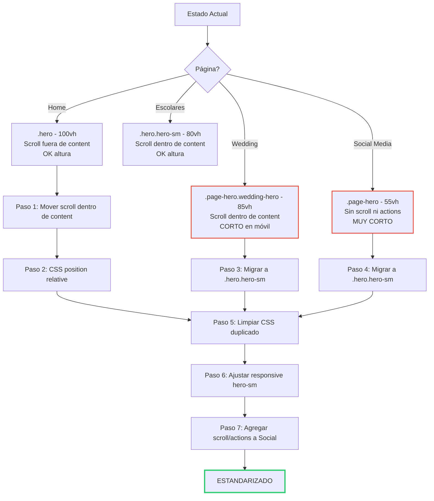

# Plan: Estandarización de Heroes Responsive

## Diagnóstico Actual

### Estructuras de Hero por página

| Página | Clase CSS | Altura Desktop | Altura Móvil | Scroll Indicator | 
|--------|-----------|---------------|-------------|-----------------|
| [`index.html`](index.html) (Home) | `.hero` | `100vh` | `100vh` | Fuera de `.hero-content`, absolute |
| [`monti-escolares.html`](monti-escolares.html) | `.hero.hero-sm` | `80vh` / min 620px | `auto` / min 520px | Dentro de `.hero-content`, relative |
| [`monti-estudio.html`](monti-estudio.html) (Wedding) | `.page-hero.wedding-hero` | `85vh` / min 600px / max 800px | `55vh` / min 400px | Dentro de `.page-hero-content`, relative |
| [`monti-social.html`](monti-social.html) | `.page-hero` | `55vh` / min 420px / max 600px | `40vh` / min 320px | No tiene |

### Problemas identificados

1. **Wedding hero se ve más corto en móvil**: 
   - En móvil (≤768px), `.wedding-hero` tiene `height: 55vh; min-height: 400px` 
   - Comparado con `.hero.hero-sm` que tiene `height: auto; min-height: 520px` en móvil
   - El hero de wedding es ~150px más corto que escolares en mobile

2. **Inconsistencia de clases**: 
   - Home usa `.hero` con estructura de carrusel como hijos directos
   - Escolares usa `.hero.hero-sm` con estructura similar pero scroll indicator dentro del content
   - Wedding usa `.page-hero.wedding-hero` con clases `page-hero-*` distintas
   - Social Media usa `.page-hero` sin scroll indicator ni hero-actions

3. **Overlap en Home**: 
   - `.hero-scroll-indicator` está fuera de `.hero-content` (como hermano, no hijo)
   - Está posicionado `absolute` con `bottom: 2.5rem`
   - En pantallas pequeñas donde el contenido es alto, el botón "Conocer más" y el indicador de scroll se superponen

---

## Plan de Acción

### Paso 1: Mover scroll indicator dentro de `.hero-content` en Home

**Archivo:** [`index.html`](index.html:99)

**Cambio:** Mover el bloque `.hero-scroll-indicator` de fuera a dentro de `.hero-content`, justo después de `.hero-actions`, como ya está estructurado en escolares y wedding.

**Estructura actual (home):**
```html
<section class="hero" id="hero">
  <div class="hero-overlay"></div>
  <div class="hero-content">
    <p class="hero-tagline">...</p>
    <h1 class="hero-title">...</h1>
    <p class="hero-subtitle">...</p>
    <div class="hero-actions">...</div>
  </div>
  <div class="hero-scroll-indicator">  ← FUERA de hero-content
    <span></span>
    SCROLL
  </div>
</section>
```

**Estructura nueva (home):**
```html
<section class="hero" id="hero">
  <div class="hero-overlay"></div>
  <div class="hero-content">
    <p class="hero-tagline">...</p>
    <h1 class="hero-title">...</h1>
    <p class="hero-subtitle">...</p>
    <div class="hero-actions">...</div>
    <div class="hero-scroll-indicator">  ← DENTRO de hero-content
      <span></span>
      SCROLL
    </div>
  </div>
</section>
```

### Paso 2: Actualizar CSS de `.hero-scroll-indicator` para Home

**Archivo:** [`index.css`](index.css:530)

Cambiar de `position: absolute` a `position: relative` en el contexto de home (cuando está dentro de hero-content), similar al inline style usado en escolares y wedding:

```css
.hero .hero-content .hero-scroll-indicator {
  position: relative;
  bottom: auto;
  left: auto;
  transform: none;
  margin-top: 3rem;
}
```

### Paso 3: Unificar Wedding hero a usar `.hero.hero-sm`

**Archivo:** [`monti-estudio.html`](monti-estudio.html:56)

**Cambio:** Cambiar la sección hero de wedding para que use la misma estructura y clases que escolares (`.hero.hero-sm` en lugar de `.page-hero.wedding-hero`), manteniendo el carrusel de imágenes.

**Cambios específicos:**
- Reemplazar `<section class="page-hero wedding-hero" ...>` por `<section class="hero hero-sm" id="hero" ...>`
- Reemplazar `.page-hero-overlay` por `.hero-overlay`
- Reemplazar `.page-hero-content` por `.hero-content`
- Reemplazar `.page-hero-tagline` por `.hero-tagline`
- Reemplazar `.page-hero-title` por `.hero-title`
- Reemplazar `.page-hero-subtitle` por `.hero-subtitle`
- Mantener las clases `wedding-hero-bg` para el carrusel (o renombrar a `hero-carousel-bg`)

### Paso 4: Unificar Social Media hero a usar `.hero.hero-sm`

**Archivo:** [`monti-social.html`](monti-social.html:55)

**Cambio:** Cambiar la sección hero de social media a usar `.hero.hero-sm`, agregar scroll indicator y hero-actions para consistencia.

### Paso 5: Limpiar CSS duplicado

**Archivo:** [`index.css`](index.css:1511-1624)

**Cambio:** 
- Eliminar o reducir las reglas de `.page-hero`, `.page-hero-content`, `.page-hero-overlay`, `.page-hero-tagline`, `.page-hero-title`, `.page-hero-subtitle` si wedding y social ya no las usan.
- Eliminar las reglas de `.wedding-hero` (líneas 1900-1904) que definen height, ya que al usar `.hero.hero-sm` heredará esas alturas.
- Mantener las reglas específicas de wedding como `.wedding-tagline`, `.wedding-title`, `.wedding-subtitle` para colores whites.

### Paso 6: Ajustar responsivo de `.hero.hero-sm` para mejor comportamiento móvil

**Archivo:** [`index.css`](index.css:430-437)

Asegurar que todos los heroes internos tengan consistencia en móvil:
- Home (`.hero`): mantener `100vh` - es el hero principal
- Heroes internos (`.hero.hero-sm`): `height: auto; min-height: 520px` (ya está definido)
- Wedding y Social ahora usarán `.hero.hero-sm` y heredarán estos valores

### Paso 7: Agregar scroll indicator y hero-actions a Social Media

**Archivo:** [`monti-social.html`](monti-social.html:57-62)

Agregar dentro de `.hero-content`:
- Un `.hero-actions` con botón CTA (similar a las otras páginas)
- Un `.hero-scroll-indicator` al final

---

## Resumen Visual del Flujo



---

## Archivos a modificar

1. [`index.html`](index.html) - Mover scroll indicator dentro de hero-content (líneas 82-102)
2. [`monti-estudio.html`](monti-estudio.html) - Cambiar a `.hero.hero-sm` (líneas 55-85)
3. [`monti-social.html`](monti-social.html) - Cambiar a `.hero.hero-sm` y agregar elementos faltantes (líneas 55-63)
4. [`index.css`](index.css) - Varias secciones:
   - Línea 530: Agregar regla para `.hero .hero-content .hero-scroll-indicator`
   - Líneas 1511-1624: Simplificar/remover `.page-hero` si ya no se usa
   - Líneas 1899-1904: Remover/actualizar `.wedding-hero` si ya no se usa
   - Líneas 2088-2103: Actualizar responsive de wedding
5. [`monti-escolares.html`](monti-escolares.html) - Remover inline styles duplicados en `hero.hero-sm` (líneas 20-41) que ya no son necesarios si el CSS base se encarga

---

## Notas adicionales

- El carrusel de imágenes de wedding (`.wedding-hero-bg`) se puede mantener con su nombre de clase actual ya que tiene animación específica (20s vs 45s del home). No es necesario cambiar su funcionamiento.
- El hero de Social Media actualmente no tiene imagen de fondo ni carrusel. Al migrar a `.hero.hero-sm`, se podría agregar un fondo oscuro degradado (ya definido en `.page-hero`) o considerar agregar una imagen/video más adelante.
- Los inline styles en `monti-escolares.html` (`.hero.hero-sm` con `min-height: 680px !important`) fueron probablemente un fix temporal y deben eliminarse ahora que el CSS base se estandariza.
