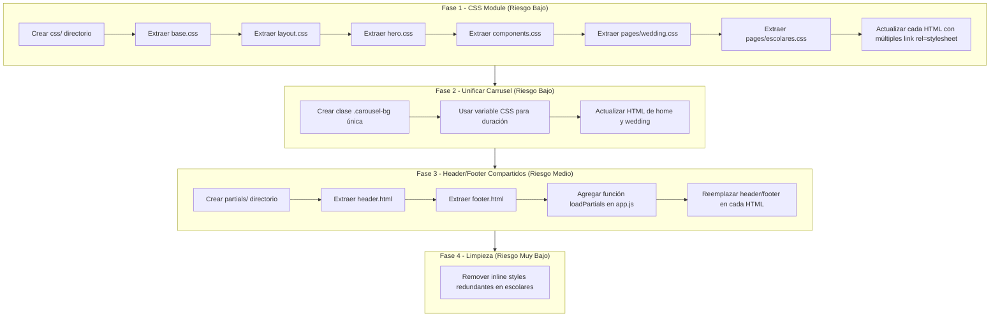

# Plan: Reestructuración del Proyecto Montipage

## Diagnóstico Actual

| Archivo | Líneas | Problema |
|---------|--------|----------|
| [`index.css`](index.css) | ~2003 | **Monolítico** — todo el CSS global en un solo archivo |
| [`app.js`](app.js) | ~176 | Un solo archivo, pero bien organizado internamente |
| Cada HTML | ~300-400 | **Header y footer duplicados** en las 4 páginas (~145 líneas c/u) |
| `hero-carousel-bg` vs `wedding-hero-bg` | - | **Código duplicado**: misma animación `heroFade` con diferentes tiempos |

---

## Priorización

### Fase 1: Separar CSS en archivos por componente (Riesgo: Bajo | Impacto: Alto)

Dividir [`index.css`](index.css) en archivos modulares. Esto NO cambia nada visual, solo organiza mejor.

```
css/
├── base.css          ← Reset, variables, tipografía, scrollbar (~100 lines)
├── layout.css        ← Header, navegación, container, footer (~200 lines)
├── hero.css          ← Hero principal, hero-sm, carruseles, animaciones (~250 lines)
├── components.css    ← Botones, cards, servicios, stats, logos (~500 lines)
├── pages/
│   ├── wedding.css   ← Wedding-specific (planes, imágenes, shimmer) (~200 lines)
│   └── escolares.css ← Escolares-specific (planes grid) (~150 lines)
└── utils.css         ← Scroll reveal, animaciones compartidas (~50 lines)
```

**Ventaja**: Cada página carga SOLO lo que necesita. Wedding no necesita cargar reglas de escolares y viceversa.

**Cambios necesarios**:
- Crear directorio `css/` y archivos individuales
- Extraer secciones del `index.css` actual a cada archivo
- Actualizar cada HTML para que importe los CSS que necesita (ej: wedding.html carga `base.css` + `layout.css` + `hero.css` + `components.css` + `pages/wedding.css`)

### Fase 2: Unificar carrusel duplicado (Riesgo: Bajo | Impacto: Medio)

Actualmente hay dos implementaciones del mismo carrusel cross-fade:

| Clase | Animación | Duración | Usado en |
|-------|-----------|----------|----------|
| `.hero-carousel-bg` | `heroFade` | 45s (15 imágenes) | Home |
| `.wedding-hero-bg` | `heroFade` | 20s (4 imágenes) | Wedding |

**Solución**: Crear una clase única `.carousel-bg` parametrizada con variables CSS para la duración.

```css
.carousel-bg {
  position: absolute;
  top: 0; left: 0;
  width: 100%; height: 100%;
  background-size: cover;
  background-position: center 30%;
  opacity: 0;
  animation: heroFade var(--carousel-duration, 45s) ease-in-out infinite;
  z-index: 1;
}
```

Luego cada sección define su duración:
```css
.hero { --carousel-duration: 45s; }
.wedding-hero-sm { --carousel-duration: 20s; }
```

Y los `nth-child` delays se calculan como porcentaje de `--carousel-duration` o se mantienen como están.

**Alternativa más simple**: Mantener las clases separadas pero mover el `@keyframes heroFade` a un archivo compartido y eliminar la duplicación de la definición del keyframe (ya está compartido).

### Fase 3: Header y footer compartidos (Riesgo: Medio | Impacto: Alto)

Cada página HTML duplica ~50 líneas de header y ~95 líneas de footer (~145 líneas de HTML duplicado x 4 páginas = ~580 líneas duplicadas).

**Solución con HTML + JS (sin build tools)**:

Usar JavaScript para inyectar header y footer desde archivos parciales:

1. Crear `partials/header.html` y `partials/footer.html`
2. En cada HTML, reemplazar el header/footer literal con:
```html
<div data-include="partials/header.html"></div>
```
3. En `app.js`, agregar función `loadPartials()` que hace fetch de cada `data-include` e inyecta el HTML

**Ventaja**: Cambiar un link en el navegación se hace 1 vez, no 4.
**Desventaja**: Dependencia de JS para renderizar contenido crítico (SEO). Mitigación: los enlaces del footer/nav no son contenido principal.

**Alternativa Server-Side Include (SSI)**: Si el servidor lo soporta (Apache/Nginx), usar `<!--#include virtual="partials/header.html" -->`. Pero no es estándar en todos los hosts.

### Fase 4: Limpiar inline styles restantes (Riesgo: Muy Bajo | Impacto: Bajo)

Actualmente quedan:

| Archivo | Línea | Inline Style | Razón |
|---------|-------|-------------|-------|
| [`monti-escolares.html`](monti-escolares.html:65) | Título | `style="color:#ffffff"` | Ya lo cubre `.hero-content h1` |
| [`monti-escolares.html`](monti-escolares.html:66) | Subtítulo | `style="color:#ffffff"` | Ya lo cubre `.hero-content p` |
| [`monti-estudio.html`](monti-estudio.html:57) | Hero bg | `style="background-image:..."` | Necesario para fondo estático inicial |
| `monti-social.html:56` | Hero bg | `style="background: linear-gradient(...)"` | Gradiente como fondo |

Los inline styles de color en escolares se pueden mover al CSS si se quiere, pero son inofensivos. Los background-image en hero son necesarios porque se cargan dinámicamente.

---

## Resumen Visual del Flujo de Trabajo



---

## Detalle de Archivos por Fase

### Fase 1: CSS Modular

**Archivos a crear:**

| Archivo | Contenido | Lines Estimado |
|---------|-----------|---------------|
| [`css/base.css`](css/base.css) | `@import url(...)`, `:root`, `*`, `html`, `body`, `::scrollbar`, `h1-h6`, `p`, `a`, `img` | ~100 |
| [`css/layout.css`](css/layout.css) | `.container`, `.section`, `.header`, `.nav-*`, `.footer`, `.footer-*`, `.form-group` | ~250 |
| [`css/hero.css`](css/hero.css) | `.hero`, `.hero.hero-sm`, `.hero-carousel-bg`, `.hero-overlay`, `.hero-content`, `.hero-tagline`, `.hero-title`, `.hero-subtitle`, `.hero-actions`, `.hero-scroll-indicator`, animation-delays, `@keyframes` | ~280 |
| [`css/components.css`](css/components.css) | `.btn*`, `.about-*`, `.stats-*`, `.services-*`, `.service-card*`, `.split-layout`, `.section-header`, `.feature-list`, `.logos-*` | ~500 |
| [`css/pages/wedding.css`](css/pages/wedding.css) | `.wedding-hero-bg*`, `.wedding-tagline`, `.wedding-title`, `.wedding-subtitle`, `.section-wedding-plans`, `.wedding-image*`, `.wedding-plan-*`, `@keyframes weddingShimmer` | ~200 |
| [`css/pages/escolares.css`](css/pages/escolares.css) | `.planes-grid`, `.plan-card*`, `.plan-badge`, `.plan-name`, `.plan-price`, `.plan-features`, `.plan-bonus`, `.plan-cta` | ~150 |
| [`css/utils.css`](css/utils.css) | `.reveal`, `.delay-*`, `@keyframes fadeUp`, scroll-reveal animations | ~50 |

**Archivos a modificar:**
- [`index.html`](index.html) — Reemplazar `<link rel="stylesheet" href="index.css">` con los imports necesarios
- [`monti-escolares.html`](monti-escolares.html) — Igual
- [`monti-estudio.html`](monti-estudio.html) — Igual
- [`monti-social.html`](monti-social.html) — Igual
- **NO** modificar `index.css` aún (mantener como respaldo hasta validar)

### Fase 2: Unificar Carrusel

**Archivos a modificar:**
- [`css/hero.css`](css/hero.css) — Crear `.carousel-bg` unificado y eliminar duplicación de `@keyframes heroFade`
- [`index.html`](index.html) — Cambiar `.hero-carousel-bg` → `.carousel-bg`
- [`monti-estudio.html`](monti-estudio.html) — Cambiar `.wedding-hero-bg` → `.carousel-bg`
- [`app.js`](app.js:173-174) — Cambiar `lazyLoadCarousel('.hero-carousel-bg')` y `lazyLoadCarousel('.wedding-hero-bg')` a `lazyLoadCarousel('.carousel-bg')`

### Fase 3: Header/Footer Compartidos

**Archivos a crear:**
- [`partials/header.html`](partials/header.html) — El bloque `<header>` de una página (parametrizar active link)
- [`partials/footer.html`](partials/footer.html) — El bloque `<footer>` completo

**Archivos a modificar:**
- [`app.js`](app.js) — Agregar función `loadPartials()` al inicio
- Cada HTML — Reemplazar header/footer con `<div data-include="...">`

**Consideración**: El link activo en la navegación (el que tiene `style="color: var(--color-light)"`) necesita pasarse como parámetro. Se puede hacer con un `data-active-page="escolares"` en el `<div data-include>` y que JS lo procese.

### Fase 4: Limpieza

**Archivos a modificar:**
- [`monti-escolares.html`](monti-escolares.html:65-66) — Remover `style="color:#ffffff"` del título y subtítulo
- Verificar que no queden otros inline styles innecesarios

---

## Riesgos y Mitigaciones

| Riesgo | Probabilidad | Mitigación |
|--------|-------------|------------|
| Fase 3: JS no carga → header/footer no aparecen | Baja | Usar `defer` en script y mostrar un mensaje de fallback |
| Fase 1: Ruta de CSS incorrecta | Media | Verificar rutas relativas al HTML (no al CSS) |
| Fase 2: Renombrar clases rompe algo | Baja | Buscar todas las referencias antes de cambiar |
| Fase 3: Dependencia de JS para SEO | Media | Los motores de búsqueda modernos ejecutan JS básico, y el contenido principal (hero, servicios, planes) no depende de partials |

---

## Orden de Ejecución Recomendado

1. **Fase 1** → CSS modular (divide el monolito, sin riesgo visual)
2. **Fase 4** → Limpieza inline styles (rápido, prepara el terreno)
3. **Fase 2** → Unificar carrusel (depende de Fase 1 para tener hero.css)
4. **Fase 3** → Header/footer compartidos (último, más riesgoso)
