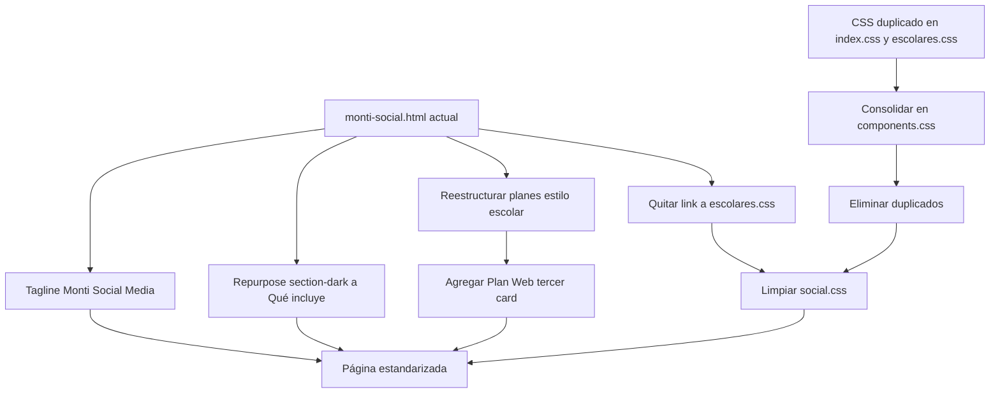

# Plan: Estandarización de la Página Social Media

## Objetivo

Ajustar [`monti-social.html`](monti-social.html) para alinearlo visual y estructuralmente con
[`monti-escolares.html`](monti-escolares.html): corregir el tagline del hero, eliminar la sección
redundante post-hero, estandarizar las tarjetas de planes con el mismo componente visual de escolar,
agregar el Plan Web adaptado y eliminar la duplicación de CSS siguiendo las prácticas ya aplicadas en
el resto de la app (partials compartidos, CSS por componente, hero estandarizado).

## Diagnóstico

| Aspecto | Estado actual | Problema |
|---------|---------------|----------|
| Tagline hero | `Social Media` en [`monti-social.html`](monti-social.html:41) | No sigue el patrón `Monti X` usado en escolares y wedding |
| Sección post-hero | `section-dark` con `split-layout` (líneas 62-95) | **Redundante**: repite el mismo título del hero "Estrategia Digital de Alto Impacto" y rompe el flujo hero → planes → footer |
| Tarjetas de planes | `planes-grid-2` + `plan-subtitle` + `plan-section-title` + `plan-sub-list` | Estilo visual distinto al componente `plan-card` de escolar |
| Cantidad de planes | Solo 2 (Creador, Institucional) | Falta el Plan Web |
| CSS de planes | Duplicado en [`index.css`](index.css:1521) y [`css/pages/escolares.css`](css/pages/escolares.css:5) | Duplicación de código |
| Link CSS | social carga `css/pages/escolares.css` (línea 23) | Acoplamiento de una página de servicio a otra |

**Alcance verificado:**
- `index.html` (home) NO usa `.plan-card`; solo escolar, social y wedding (`.plan-cta` dentro de
  `.wedding-plan-card`).
- Las clases exclusivas de social (`plan-section-title`, `plan-sub-list`, `planes-grid-2`,
  `plan-subtitle`, `section-dark`) solo aparecen en [`monti-social.html`](monti-social.html).
- Todas las páginas cargan `css/components.css`, por lo que es el lugar seguro para componentes
  compartidos.

## Evaluación crítica del plan (self-review)

### Debilidades identificadas

1. **Bloque de mayor radio de impacto**: el paso de consolidar CSS toca
   [`index.css`](index.css:1521), monolito legacy de ~1998 líneas que cargan las 4 páginas.
   Mitigación verificada: el bloque a mover es autocontenido, no hay otras reglas `.plan-*` en
   `index.css`, home no usa plan cards y wedding usa `.wedding-plan-card` (no `.plan-card`). El único
   elemento compartido es `.plan-cta`, que wedding también usa y seguirá disponible vía
   `components.css` (wedding ya lo carga antes de `wedding.css`).

2. **Riesgo de inventar contenido**: la versión original proponía agregar `plan-delivery`
   ("Inicio inmediato") a los planes existentes. Eso **inventa** datos y contradice
   "respetando la info que ya esta". Corrección: solo el Plan Web lleva `plan-delivery` (tiene dato
   real: 7-10 días laborables). Los planes Creador e Institucional solo aplanan sus features
   existentes y conservan su `plan-bonus`.

3. **Pérdida de contenido del `section-dark`**: esa sección contiene una lista útil de servicios
   (estrategia, community management, ads, branding, analytics). Eliminarla a secas es pérdida
   irreversible de información. Decisión necesaria: descartarla por redundancia o repurposarla como
   bloque breve "Qué incluye" antes de los planes. Se propone repurpose para no perder info.

4. **Ancla del CTA del hero**: el CTA apunta a `#planes-social`. Se mantiene el `id` para no romper
   el ancla; renombrar a `service-detail` (paridad total con escolar) agrega churn sin beneficio
   funcional. Se documenta la decisión de mantener `planes-social`.

5. **Densidad de la tarjeta destacada**: Plan Institucional tiene ~12 bullets + bonus; en grid de 3
   columnas la tarjeta central será más alta que las vecinas (escolar tolera lo mismo con
   `align-items: start`). Aceptable y consistente, pero conviene revisar el largo de algunos bullets
   al aplanar.

### ¿Es correcto lo que propongo? Cuestionamientos

- **Q1: ¿Eliminar `section-dark` o repurpose?** El argumento fuerte para quitarla es la redundancia
  con el hero y que escolar no tiene ese bloque. El contraargumento es conservar la información de
  servicios. Conclusión: repurpose como sección corta "Qué incluye" antes de planes (reutiliza
  `.section-header` + `feature-list` ya existentes, sin CSS nuevo).
- **Q2: ¿Consolidar en `components.css` o tocar `index.css` es necesario?** Es lo correcto según el
  propio roadmap [`plans/plan-reestructuracion-general.md`](plans/plan-reestructuracion-general.md)
  (Fase 1: componentes compartidos en `components.css`). Alternativa de menor riesgo: dejar `index.css`
  como fuente canónica y solo borrar la copia muerta de `escolares.css` + desacoplar social. La
  consolidación en `components.css` es superior a largo plazo (avanza hacia retirar `index.css`) y el
  riesgo es bajo con las verificaciones hechas, por lo que se recomienda.
- **Q3: ¿Precio/nombre del Plan Web?** Se propone espejo de escolar: USD $500, pago único, nombre
  "Plan Web". Requiere confirmación del usuario (ver Preguntas abiertas).

### Vulnerabilidades

- **Cascada CSS**: si se consolida, ningún CSS posterior debe redefinir `.plan-*` para revertir.
  Verificado: las únicas reglas `.plan-*` en `index.css` son las que se mueven. Bajo riesgo.
- **Anclas rotas**: cualquier cambio de `id` en la sección de planes rompe el CTA del hero. Se evita
  renombrar.
- **WhatsApp del Plan Web**: si se copia-pega el enlace de escolar diría "colegios"; hay que redactar
  un texto nuevo adaptado a social media.
- **`!important` en `.hero-social`**: olor pre-existente que puede chocar si luego se estandariza el
  fondo del hero. Se documenta, no se toca en este alcance.

### Problemas de rendimiento

- **Ganancia positiva**: quitar `escolares.css` de social ahorra 1 request (~6KB) y la deduplicación
  reduce bytes totales servidos (se quitan 2 copias, se agrega 1).
- **Sin nuevos recursos**: el Plan Web no agrega imágenes ni scripts; la página no gana peso
  render-blocking.
- **Deuda real (fuera de alcance)**: `index.css` (~1998 líneas) sigue cargándose en todas las páginas
  duplicando componentes. La consolidación de este plan avanza parcialmente su retiro; el retiro total
  es un refactor aparte.

## Cambios

### 1. Hero: tagline

- [`monti-social.html`](monti-social.html:41): cambiar `Social Media` por `Monti Social Media`.

### 2. Reemplazar sección post-hero por "Qué incluye" (repurpose)

- Eliminar el `section-dark` con `split-layout` (líneas 62-95).
- Insertar una sección breve con `.section-header` + `feature-list` reutilizando la info existente
  (estrategia, community management, producción de contenido, ads, branding, analytics). Sin CSS nuevo.

### 3. Reestructurar planes con el estilo de escolar

- Reemplazar `planes-grid planes-grid-2` por `planes-grid` (3 columnas, como escolares).
- Convertir `plan-section-title` + `plan-sub-list` en `plan-features` planas con checkmark,
  **preservando toda la información existente** (ej: "12 posts mensuales (6 reels + 6 piezas)").
- Conservar el `plan-bonus` del Plan Institucional. NO inventar `plan-delivery` en planes existentes.
- Conservar los enlaces de WhatsApp con su texto original.

### 4. Agregar Plan Web adaptado

- Tercer card "Plan Web" adaptado del "Plan Web Institucional" de escolares
  ([`monti-escolares.html`](monti-escolares.html:155)):
  - USD $500 · pago único · 50% al iniciar / 50% contra entrega.
  - Features adaptadas para marcas y negocios (secciones: Inicio, Nosotros, Servicios, Portafolio,
    Contacto en lugar de Oferta Académica / Admisiones).
  - `plan-bonus-note` (mantenimiento 1er año) + `plan-delivery` (7 a 10 días laborables).
  - WhatsApp link con texto nuevo adaptado a social media (no copiar el de escolares).

### 5. Consolidar CSS de planes (una sola fuente)

- Mover los estilos de `.planes-grid`, `.plan-card*`, `.plan-badge`, `.plan-name`, `.plan-price`,
  `.plan-features`, `.plan-bonus*`, `.plan-delivery`, `.plan-cta` y su responsive a
  [`css/components.css`](css/components.css).
- Eliminar la copia duplicada de [`index.css`](index.css:1521-1706), conservando el logo carousel
  que inicia después (línea 1708).
- Eliminar la copia de [`css/pages/escolares.css`](css/pages/escolares.css:5-186), conservando solo
  el logo carousel (a partir de la línea 188).

### 6. Limpiar css/pages/social.css

- Eliminar `.planes-grid-2`, `.plan-subtitle`, `.plan-section-title` y `.plan-sub-list`.
- Conservar únicamente `.hero-social` (fondo del hero).

### 7. Quitar el acoplamiento CSS

- En [`monti-social.html`](monti-social.html:23) eliminar el `<link>` a `css/pages/escolares.css`.
  Los estilos de planes ahora llegan por `css/components.css`.

## Preguntas abiertas

1. ¿Eliminar la info del `section-dark` (pérdida) o repurpose como "Qué incluye"? Se propone repurpose.
2. ¿Nombre y precio del Plan Web? Se propone "Plan Web" a USD $500 pago único (espejo de escolar).
3. ¿Consolidación en `components.css` (recomendada) o enfoque mínimo sin tocar `index.css`?

## Flujo de trabajo

## Verificación

- Abrir [`monti-social.html`](monti-social.html) y confirmar: tagline, sección "Qué incluye", grid de
  3 planes con el estilo escolar y el Plan Web con su WhatsApp adaptado.
- Revisar [`monti-escolares.html`](monti-escolares.html) y [`monti-estudio.html`](monti-estudio.html)
  para confirmar que no cambian visualmente tras la consolidación de CSS.
- Buscar referencias restantes a `plan-section-title`, `plan-sub-list`, `planes-grid-2`,
  `plan-subtitle` y `.plan-*` en `index.css` para asegurar que no quedan duplicados.
