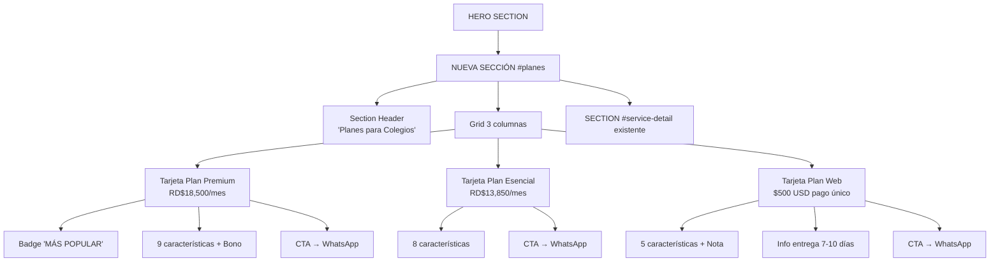

# Plan: Sección de Tarjetas de Planes en monti-escolares.html

## Objetivo

Agregar una sección de planes de precios con tarjetas debajo del **hero** y **antes de la sección `#service-detail`** en [`monti-escolares.html`](monti-escolares.html).

Incluye:
- **3 tarjetas de planes** (Premium, Esencial, Web Institucional)
- **Integración con WhatsApp**: cada botón CTA abre un mensaje predefinido en WhatsApp

---

## Estructura de la página (estado actual)

```
[HEADER / NAVIGATION]
[HERO SECTION]            → Video fullscreen con tagline y CTA
[SECTION #service-detail] → Split layout: imagen + contenido
[FOOTER]
```

## Estructura deseada

```
[HEADER / NAVIGATION]
[HERO SECTION]
[NUEVA SECTION #planes]   → 3 tarjetas de planes (Premium, Esencial, Web)
[SECTION #service-detail]
[FOOTER]
```

---

## Diseño visual de las tarjetas

- **Fondo oscuro** (clase `.section-dark`) para contrastar con la sección blanca de `#service-detail`.
- **Header de sección**: Título "Planes para Colegios" + subtítulo "Elige el plan que mejor se adapte a las necesidades de tu institución."
- **Grid de 3 columnas** en desktop → 1 columna en mobile.
- Cada tarjeta tiene:
  - Nombre del plan
  - Precio destacado
  - Nota de impuestos (si aplica)
  - Lista de características con checkmarks
  - Bono destacado (si aplica)
  - Botón CTA → abre WhatsApp con mensaje pre-rellenado

---

## WhatsApp Integration

Cada botón CTA será un enlace `https://wa.me/[NUMERO]?text=[MENSAJE]` que abre WhatsApp con un mensaje personalizado según el plan seleccionado.

**Ejemplo de mensajes:**

| Plan | Mensaje WhatsApp |
|------|-----------------|
| Premium | `Hola Montipage, estoy interesado en el Plan Premium para colegios (RD$18,500/mes). ¿Podrían darme más información?` |
| Esencial | `Hola Montipage, estoy interesado en el Plan Esencial para colegios (RD$13,850/mes). ¿Podrían darme más información?` |
| Web Institucional | `Hola Montipage, estoy interesado en el Plan Web Institucional ($500 USD). ¿Podrían darme más información?` |

> ⚠️ **PENDIENTE**: Necesito el número de WhatsApp para completar los enlaces `wa.me`. Debe ser en formato internacional sin signos (ej. 1829XXXXXXX).

---

## HTML de la nueva sección

Insertar entre el cierre del hero (`</section>` línea 107) y la apertura de `#service-detail` (línea 112).

```html
<!-- ==========================================
   PLANS / PRICING SECTION
   ========================================== -->
<section class="section-dark" id="planes">
  <div class="container">
    <div class="section-header reveal">
      <h2>Planes para Colegios</h2>
      <p>Elige el plan que mejor se adapte a las necesidades de tu institución.</p>
    </div>

    <div class="planes-grid">

      <!-- Plan Premium -->
      <div class="plan-card plan-card-featured reveal delay-100">
        <div class="plan-badge">MÁS POPULAR</div>
        <h3 class="plan-name">Plan Premium</h3>
        <div class="plan-price">
          <span class="plan-currency">RD$</span>
          <span class="plan-amount">18,500</span>
          <span class="plan-period">/mes</span>
        </div>
        <p class="plan-tax">ITBIS no incluido</p>
        <ul class="plan-features">
          <li>2 visitas mensuales (2 horas c/u)</li>
          <li>4 reels mensuales</li>
          <li>Sesiones fotográficas en cada visita</li>
          <li>18 publicaciones mensuales</li>
          <li>Gestión de Instagram y Facebook</li>
          <li>Línea gráfica institucional profesional</li>
          <li>3 infográficos mensuales (valores, educación, promociones)</li>
          <li>Planificación estratégica mensual</li>
          <li>Generación de leads (sin inversión publicitaria)</li>
        </ul>
        <div class="plan-bonus">
          <strong>BONO INCLUIDO:</strong>
          <p>2 campañas publicitarias al año &middot; Presupuesto: US$100/año &middot; Segmentación básica para captación de estudiantes</p>
        </div>
        <a href="https://wa.me/[NUMERO]?text=Hola%20Montipage%2C%20estoy%20interesado%20en%20el%20Plan%20Premium%20para%20colegios%20%28RD%2418%2C500%2Fmes%29.%20%C2%BFPodr%C3%ADan%20darme%20m%C3%A1s%20informaci%C3%B3n%3F" target="_blank" class="btn btn-light plan-cta">
          Solicitar Plan
          <svg width="16" height="16" viewBox="0 0 24 24" fill="currentColor" style="margin-left: 8px; vertical-align: middle;"><path d="M17.472 14.382c-.297-.149-1.758-.867-2.03-.967-.273-.099-.471-.148-.67.15-.197.297-.767.966-.94 1.164-.173.199-.347.223-.644.075-.297-.15-1.255-.463-2.39-1.475-.883-.788-1.48-1.761-1.653-2.059-.173-.297-.018-.458.13-.606.134-.133.298-.347.446-.52.149-.174.198-.298.298-.497.099-.198.05-.371-.025-.52-.075-.149-.669-1.612-.916-2.207-.242-.579-.487-.5-.669-.51-.173-.008-.371-.01-.57-.01-.198 0-.52.074-.792.372-.272.297-1.04 1.016-1.04 2.479 0 1.462 1.065 2.875 1.213 3.074.149.198 2.096 3.2 5.077 4.487.709.306 1.262.489 1.694.625.712.227 1.36.195 1.871.118.571-.085 1.758-.719 2.006-1.413.248-.694.248-1.289.173-1.413-.074-.124-.272-.198-.57-.347m-5.421 7.403h-.004a9.87 9.87 0 01-5.031-1.378l-.361-.214-3.741.982.998-3.648-.235-.374a9.86 9.86 0 01-1.51-5.26c.001-5.45 4.436-9.884 9.888-9.884 2.64 0 5.122 1.03 6.988 2.898a9.825 9.825 0 012.893 6.994c-.003 5.45-4.437 9.884-9.885 9.884m8.413-18.297A11.815 11.815 0 0012.05 0C5.495 0 .16 5.335.157 11.892c0 2.096.547 4.142 1.588 5.945L.057 24l6.305-1.654a11.882 11.882 0 005.683 1.448h.005c6.554 0 11.89-5.335 11.893-11.893a11.821 11.821 0 00-3.48-8.413z"/></svg>
        </a>
      </div>

      <!-- Plan Esencial -->
      <div class="plan-card reveal delay-200">
        <h3 class="plan-name">Plan Esencial</h3>
        <div class="plan-price">
          <span class="plan-currency">RD$</span>
          <span class="plan-amount">13,850</span>
          <span class="plan-period">/mes</span>
        </div>
        <p class="plan-tax">ITBIS no incluido</p>
        <ul class="plan-features">
          <li>1 visita mensual (2 horas)</li>
          <li>Grabación de contenido dentro del colegio</li>
          <li>2 reels editados</li>
          <li>Sesión fotográfica básica (vida escolar)</li>
          <li>Edición de fotos y videos</li>
          <li>11 publicaciones mensuales</li>
          <li>Línea gráfica institucional básica</li>
          <li>Gestión de 1 red social (Instagram o Facebook)</li>
        </ul>
        <a href="https://wa.me/[NUMERO]?text=Hola%20Montipage%2C%20estoy%20interesado%20en%20el%20Plan%20Esencial%20para%20colegios%20%28RD%2413%2C850%2Fmes%29.%20%C2%BFPodr%C3%ADan%20darme%20m%C3%A1s%20informaci%C3%B3n%3F" target="_blank" class="btn btn-outline plan-cta">
          Solicitar Plan
          <svg width="16" height="16" viewBox="0 0 24 24" fill="currentColor" style="margin-left: 8px; vertical-align: middle;"><path d="M17.472 14.382c-.297-.149-1.758-.867-2.03-.967-.273-.099-.471-.148-.67.15-.197.297-.767.966-.94 1.164-.173.199-.347.223-.644.075-.297-.15-1.255-.463-2.39-1.475-.883-.788-1.48-1.761-1.653-2.059-.173-.297-.018-.458.13-.606.134-.133.298-.347.446-.52.149-.174.198-.298.298-.497.099-.198.05-.371-.025-.52-.075-.149-.669-1.612-.916-2.207-.242-.579-.487-.5-.669-.51-.173-.008-.371-.01-.57-.01-.198 0-.52.074-.792.372-.272.297-1.04 1.016-1.04 2.479 0 1.462 1.065 2.875 1.213 3.074.149.198 2.096 3.2 5.077 4.487.709.306 1.262.489 1.694.625.712.227 1.36.195 1.871.118.571-.085 1.758-.719 2.006-1.413.248-.694.248-1.289.173-1.413-.074-.124-.272-.198-.57-.347m-5.421 7.403h-.004a9.87 9.87 0 01-5.031-1.378l-.361-.214-3.741.982.998-3.648-.235-.374a9.86 9.86 0 01-1.51-5.26c.001-5.45 4.436-9.884 9.888-9.884 2.64 0 5.122 1.03 6.988 2.898a9.825 9.825 0 012.893 6.994c-.003 5.45-4.437 9.884-9.885 9.884m8.413-18.297A11.815 11.815 0 0012.05 0C5.495 0 .16 5.335.157 11.892c0 2.096.547 4.142 1.588 5.945L.057 24l6.305-1.654a11.882 11.882 0 005.683 1.448h.005c6.554 0 11.89-5.335 11.893-11.893a11.821 11.821 0 00-3.48-8.413z"/></svg>
        </a>
      </div>

      <!-- Plan Web Institucional -->
      <div class="plan-card reveal delay-300">
        <h3 class="plan-name">Plan Admisiones Institucional</h3>
        <div class="plan-price">
          <span class="plan-currency">USD</span>
          <span class="plan-amount">$500</span>
          <span class="plan-period">pago único</span>
        </div>
        <p class="plan-tax">50% al iniciar &middot; 50% contra entrega</p>
        <ul class="plan-features">
          <li>Diseño Web Moderno: hasta 5 secciones (Inicio, Nosotros, Oferta Académica, Admisiones, Contacto)</li>
          <li>Diseño 100% Responsivo: smartphones, tablets y computadoras</li>
          <li>Integración Multimedia: fotos, galerías y videos promocionales</li>
          <li>Herramientas de Captación: botón flotante WhatsApp + formulario de contacto</li>
          <li>Conexión Social: enlaces a redes sociales oficiales</li>
        </ul>
        <div class="plan-bonus plan-bonus-note">
          <strong>Nota:</strong>
          <p>Este plan no incluye la compra del dominio (.com/.edu), alojamiento web (hosting) ni servicios de mantenimiento mensual.</p>
        </div>
        <div class="plan-delivery">
          <strong>Tiempo de entrega:</strong> 7 a 10 días laborables
        </div>
        <a href="https://wa.me/[NUMERO]?text=Hola%20Montipage%2C%20estoy%20interesado%20en%20el%20Plan%20Web%20Institucional%20%28%24500%20USD%29.%20%C2%BFPodr%C3%ADan%20darme%20m%C3%A1s%20informaci%C3%B3n%3F" target="_blank" class="btn btn-outline plan-cta">
          Solicitar Plan
          <svg width="16" height="16" viewBox="0 0 24 24" fill="currentColor" style="margin-left: 8px; vertical-align: middle;"><path d="M17.472 14.382c-.297-.149-1.758-.867-2.03-.967-.273-.099-.471-.148-.67.15-.197.297-.767.966-.94 1.164-.173.199-.347.223-.644.075-.297-.15-1.255-.463-2.39-1.475-.883-.788-1.48-1.761-1.653-2.059-.173-.297-.018-.458.13-.606.134-.133.298-.347.446-.52.149-.174.198-.298.298-.497.099-.198.05-.371-.025-.52-.075-.149-.669-1.612-.916-2.207-.242-.579-.487-.5-.669-.51-.173-.008-.371-.01-.57-.01-.198 0-.52.074-.792.372-.272.297-1.04 1.016-1.04 2.479 0 1.462 1.065 2.875 1.213 3.074.149.198 2.096 3.2 5.077 4.487.709.306 1.262.489 1.694.625.712.227 1.36.195 1.871.118.571-.085 1.758-.719 2.006-1.413.248-.694.248-1.289.173-1.413-.074-.124-.272-.198-.57-.347m-5.421 7.403h-.004a9.87 9.87 0 01-5.031-1.378l-.361-.214-3.741.982.998-3.648-.235-.374a9.86 9.86 0 01-1.51-5.26c.001-5.45 4.436-9.884 9.888-9.884 2.64 0 5.122 1.03 6.988 2.898a9.825 9.825 0 012.893 6.994c-.003 5.45-4.437 9.884-9.885 9.884m8.413-18.297A11.815 11.815 0 0012.05 0C5.495 0 .16 5.335.157 11.892c0 2.096.547 4.142 1.588 5.945L.057 24l6.305-1.654a11.882 11.882 0 005.683 1.448h.005c6.554 0 11.89-5.335 11.893-11.893a11.821 11.821 0 00-3.48-8.413z"/></svg>
        </a>
      </div>

    </div>
  </div>
</section>
```

---

## CSS: Nuevas reglas en [`index.css`](index.css)

Agregar al final del archivo:

```css
/* ==========================================================================
   PLANS / PRICING CARDS (Escolares page)
   ========================================================================== */

.planes-grid {
  display: grid;
  grid-template-columns: 1fr 1fr 1fr;
  gap: 1.5rem;
  align-items: start;
  max-width: 1200px;
  margin: 0 auto;
}

.plan-card {
  background-color: var(--color-gray-900);
  border: 1px solid var(--color-gray-800);
  border-radius: var(--border-radius);
  padding: 2.5rem 1.75rem;
  position: relative;
  display: flex;
  flex-direction: column;
  transition: var(--transition-smooth);
}

.plan-card:hover {
  transform: translateY(-6px);
  border-color: var(--color-gray-500);
  box-shadow: 0 24px 48px rgba(0, 0, 0, 0.3);
}

.plan-card-featured {
  border-color: var(--color-gray-600);
  background-color: rgba(255, 255, 255, 0.04);
}

.plan-badge {
  position: absolute;
  top: -12px;
  left: 50%;
  transform: translateX(-50%);
  background-color: var(--color-light);
  color: var(--color-black);
  font-family: var(--font-heading);
  font-size: var(--fs-xs);
  font-weight: 700;
  padding: 0.3rem 1.2rem;
  border-radius: 50px;
  letter-spacing: 1px;
  text-transform: uppercase;
  white-space: nowrap;
}

.plan-name {
  font-family: var(--font-heading);
  font-size: var(--fs-lg);
  font-weight: 700;
  color: var(--color-light);
  margin-bottom: 1.5rem;
  margin-top: 0.5rem;
  text-align: center;
}

.plan-price {
  text-align: center;
  margin-bottom: 0.25rem;
  color: var(--color-light);
}

.plan-currency {
  font-size: var(--fs-md);
  font-weight: 500;
  vertical-align: super;
}

.plan-amount {
  font-size: clamp(2.2rem, 1.8rem + 2vw, 3.2rem);
  font-weight: 800;
  letter-spacing: -2px;
  line-height: 1;
}

.plan-period {
  font-size: var(--fs-sm);
  color: var(--color-gray-500);
  font-weight: 400;
}

.plan-tax {
  text-align: center;
  font-size: var(--fs-xs);
  color: var(--color-gray-500);
  margin-bottom: 1.5rem;
}

.plan-features {
  list-style: none;
  padding: 0;
  margin: 0 0 1.5rem;
  display: flex;
  flex-direction: column;
  gap: 0.7rem;
  flex: 1;
}

.plan-features li {
  display: flex;
  align-items: flex-start;
  gap: 0.6rem;
  font-size: var(--fs-sm);
  color: var(--color-gray-300);
  line-height: 1.5;
}

.plan-features li::before {
  content: '';
  flex-shrink: 0;
  width: 18px;
  height: 18px;
  margin-top: 3px;
  background-color: var(--color-light);
  mask: url("data:image/svg+xml,%3Csvg xmlns='http://www.w3.org/2000/svg' viewBox='0 0 24 24' fill='none' stroke='currentColor' stroke-width='3' stroke-linecap='round' stroke-linejoin='round'%3E%3Cpolyline points='20 6 9 17 4 12'%3E%3C/polyline%3E%3C/svg%3E") no-repeat center;
  mask-size: contain;
  -webkit-mask: url("data:image/svg+xml,%3Csvg xmlns='http://www.w3.org/2000/svg' viewBox='0 0 24 24' fill='none' stroke='currentColor' stroke-width='3' stroke-linecap='round' stroke-linejoin='round'%3E%3Cpolyline points='20 6 9 17 4 12'%3E%3C/polyline%3E%3C/svg%3E") no-repeat center;
  -webkit-mask-size: contain;
}

.plan-bonus {
  background-color: rgba(255, 255, 255, 0.06);
  border: 1px solid var(--color-gray-800);
  border-radius: var(--border-radius-sm);
  padding: 0.85rem;
  margin-bottom: 1.25rem;
  font-size: var(--fs-xs);
  color: var(--color-gray-300);
  line-height: 1.6;
}

.plan-bonus strong {
  color: var(--color-light);
  display: block;
  margin-bottom: 0.25rem;
}

.plan-bonus-note {
  border-color: rgba(255, 255, 255, 0.1);
  font-style: italic;
}

.plan-delivery {
  background-color: rgba(255, 255, 255, 0.04);
  border: 1px dashed var(--color-gray-700);
  border-radius: var(--border-radius-sm);
  padding: 0.7rem 1rem;
  text-align: center;
  font-size: var(--fs-xs);
  color: var(--color-gray-300);
  margin-bottom: 1.5rem;
}

.plan-delivery strong {
  color: var(--color-light);
}

.plan-cta {
  text-align: center;
  display: flex;
  align-items: center;
  justify-content: center;
  width: 100%;
  gap: 0.5rem;
}

/* Responsive: 3 cols -> 1 col */
@media (max-width: 1024px) {
  .planes-grid {
    grid-template-columns: 1fr;
    max-width: 550px;
  }
}

@media (max-width: 768px) {
  .plan-card {
    padding: 2rem 1.25rem;
  }
}
```

---

## Diagrama de flujo



---

## Pasos de implementación

1. **[PENDIENTE] Conseguir número WhatsApp** para reemplazar `[NUMERO]` en los enlaces.
2. Agregar el CSS de las tarjetas de planes al final de [`index.css`](index.css).
3. Insertar la nueva sección `#planes` en [`monti-escolares.html`](monti-escolares.html) entre el hero y `#service-detail`.
4. Verificar responsive: 3 columnas desktop → 1 columna mobile/tablet.
5. Hacer commit y push a `gh-pages`.
